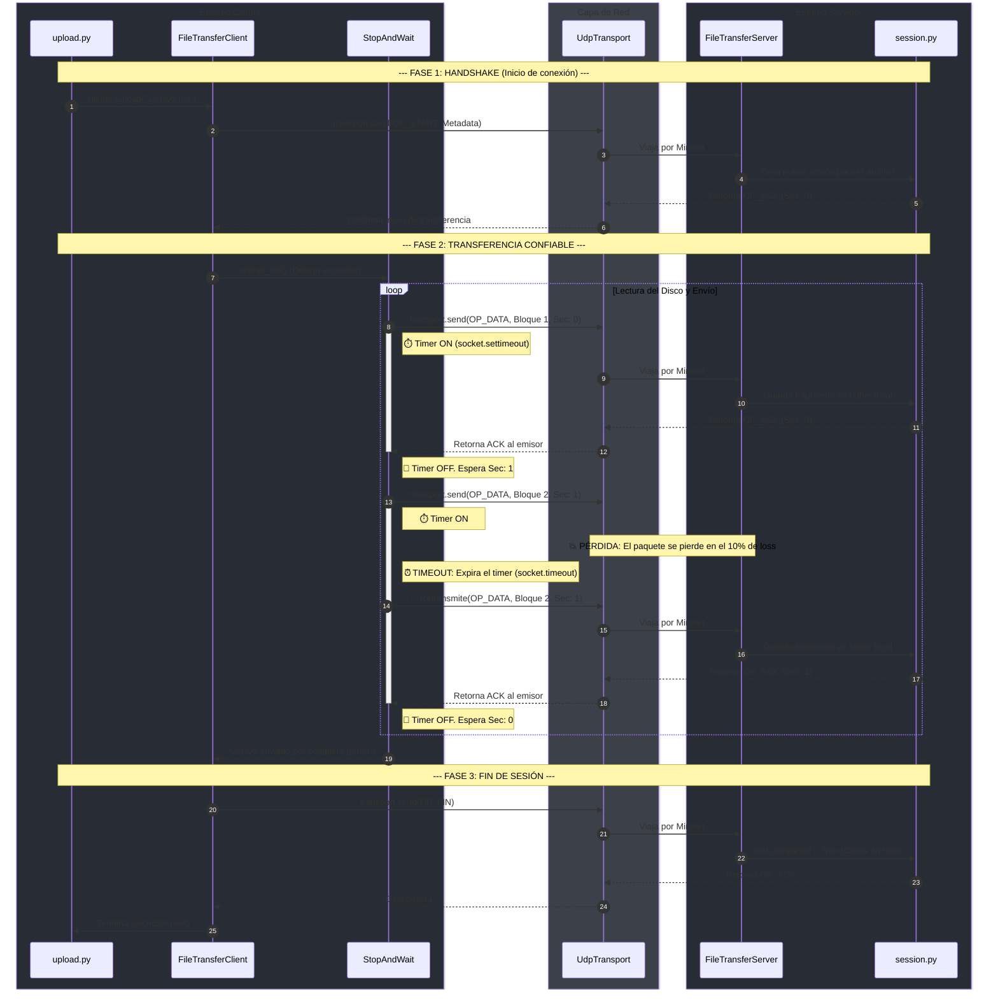

# Trabajo Práctico 1 - Redes

## Estado actual

El proyecto cuenta con un `makeFile` para preparar el entorno de desarrollo y
probar una topología básica de Mininet. La estructura actual es:

```text
src/
├── download
├── start-server
├── upload
└── lib/
	└── __init__.py
```

Los ejecutables de `src/` son esqueletos iniciales y todavía no implementan
la lógica de transferencia ni el servidor.

## Requisitos

- Ubuntu o una distribución compatible con `apt`.
- Python 3, `pip` y entornos virtuales.
- Permisos para ejecutar comandos con `sudo`.

Las dependencias del sistema se instalan automáticamente con `make setup`:

- Mininet
- Open vSwitch
- Python 3 y herramientas de entornos virtuales
- Wireshark
- `iproute2`

## Preparación del proyecto

Para instalar las dependencias del sistema, crear el entorno virtual e
inicializar la estructura del proyecto:

```bash
make setup
```

Este comando ejecuta `install-deps` e `init-project`. El entorno virtual se
crea en `venv/` y se instala `flake8` dentro de él.

También se puede ejecutar:

```bash
make all
```

`all` es equivalente a `setup`.


## Configurar plugin de Wireshark

Mover el archivo `mi_plugin.lua` dentro de la carpeta personal 
`/home/MI_CUENTA/.local/lib/wireshark/plugins/`


En una terminal ejecutar el comando 
```
sudo mn --custom src/lib/topologia.py --topo mytopo --mac
```

Abrir otra terminal y ejecutar el comando `wireshark` y seleccionar
y debería verse por pantalla `Plugin cargado correctamente`

Elegir la opción de s3-eth5 para capturar los paquetes que se envían al 
servidor a través del puerto default 5005.

## Comandos disponibles

### Verificar el estilo

```bash
make lint
```

Ejecuta `flake8` sobre `src/`.

### Probar Mininet

```bash
make test-mininet
```

Ejecuta la prueba de conectividad `pingall` de Mininet.

### Ejecutar la topología básica

```bash
make run-mininet
```

Levanta una topología `single,2` con dos hosts y enlaces configurados con
20 ms de demora y 10% de pérdida de paquetes:

```text
single,2 --link tc,loss=10,delay=20ms
```
### Ejecutar la topología custom

```
sudo mn --custom src/lib/topologia.py --topo mytopo --mac
```

Levanta una topología con 5 hosts, 4 que funcionan como clientes (del
10.0.0.1 al 10.0.0.4) y 1 que funciona como servidor (10.0.0.5) y enlaces 
configurados con 20 ms de demora y 10% de pérdida de paquetes.

### Limpiar el entorno

```bash
make clean
```

Limpia los recursos residuales de Mininet, elimina el entorno virtual `venv/`
y borra los directorios `__pycache__`.

## Flujo recomendado

```bash
make setup
make lint
make test-mininet
make run-mininet
```

## Diagrama de secuencia de Stop & Wait:

