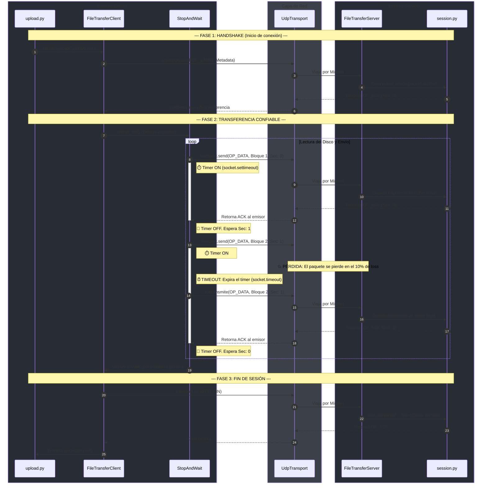

# Trabajo Práctico 1 - Redes

## Estado actual

El proyecto cuenta con un `makeFile` para preparar el entorno de desarrollo y
probar una topología básica de Mininet. La estructura actual es:

```text
src/
├── download
├── start-server
├── upload
└── lib/
	└── __init__.py
```

Los ejecutables de `src/` son esqueletos iniciales y todavía no implementan
la lógica de transferencia ni el servidor.

## Requisitos

- Ubuntu o una distribución compatible con `apt`.
- Python 3, `pip` y entornos virtuales.
- Permisos para ejecutar comandos con `sudo`.

Las dependencias del sistema se instalan automáticamente con `make setup`:

- Mininet
- Open vSwitch
- Python 3 y herramientas de entornos virtuales
- Wireshark
- `iproute2`

## Preparación del proyecto

Para instalar las dependencias del sistema, crear el entorno virtual e
inicializar la estructura del proyecto:

```bash
make setup
```

Este comando ejecuta `install-deps` e `init-project`. El entorno virtual se
crea en `venv/` y se instala `flake8` dentro de él.

También se puede ejecutar:

```bash
make all
```

`all` es equivalente a `setup`.


## Configurar plugin de Wireshark

Al hacer `make all` o `make setup` se instala automaticamente la extension de lua en las carpetas de extensiones de wireshark (la reconocida en la ultima version, por lo menos).


En caso de que no ande,mover el archivo `mi_plugin.lua` dentro de la carpeta de carga de plugins de lua `Personal Lua Plugins` y tambien en la del usuario (revisar en el propio wireshark, por si es diferente), las cuales suelen ser tanto:
`/root/.local/lib/wireshark/plugins` usando `cp` sin sudo
`/root/user/.local/lib/wireshark/plugins` usando `cp` con sudo


En una terminal ejecutar el comando 
```
make run-mininet
```

Abrir otra terminal y ejecutar el comando `sudo wireshark` y debería verse por 
pantalla `Plugin cargado correctamente`

Elegir la opción de s3-eth5 para capturar los paquetes que se envían al 
servidor a través del puerto default 5005.


## Ejecución de la Aplicación

Los scripts ejecutables se encuentran dentro de src/ y soportan los protocolos Stop & Wait (sw) y TCP con SACK (sack).

### 1. Iniciar el Servidor

Inicia el servidor en una dirección IP y puerto específicos, definiendo la carpeta de almacenamiento de archivos:
```bash
# Ejemplo: Servidor escuchando en 10.0.0.5:5005 con almacenamiento en 'storage'
./src/start-server -H 10.0.0.5 -p 5005 -s storage -v
```

#### Parámetros de start-server:
- -H, --host: Dirección IPv4 donde escucha el servidor (por defecto 127.0.0.1).
- -p, --port: Puerto UDP de escucha (rango 1024 a 65535, por defecto 5005).
- -s, --storage: Ruta del directorio donde se almacenan y buscan los archivos (por defecto storage).
- -v, --verbose: Aumenta el nivel de detalle de la salida por consola (mutuamente excluyente con -q).
- -q, --quiet: Reduce la salida por consola al mínimo (mutuamente excluyente con -v).

### 2. Subir un Archivo (UPLOAD)

Envía un archivo local hacia el servidor remoto
```bash
# Subida usando Stop & Wait
./src/upload -H 10.0.0.5 -p 5005 -s ./origen.bin -n destino.bin -r sw -v

# Subida usando TCP con SACK
./src/upload -H 10.0.0.5 -p 5005 -s ./origen.bin -n destino.bin -r sack -v
```

#### Parámetros de upload:

- -H, --host: Dirección IPv4 del servidor remoto.
- -p, --port: Puerto UDP del servidor.
- -s, --src: Ruta del archivo local de origen que se desea transferir.
- -n, --name: Nombre con el que se guardará el archivo en el servidor.
- -r, --protocol: Protocolo de transferencia confiable a utilizar (sw o sack).
- -v, --verbose / -q, --quiet: Modos de salida detallada o silenciosa.


### 3. Descargar un Archivo (DOWNLOAD)
Solicita y descarga un archivo presente en el servidor, guardándolo en la ruta local elegida.
```bash
# Descarga usando Stop & Wait
./src/download -H 10.0.0.5 -p 5005 -d ./recibido.bin -n destino.bin -r sw -v

# Descarga usando TCP con SACK
./src/download -H 10.0.0.5 -p 5005 -d ./recibido.bin -n destino.bin -r sack -v
```

#### Parámetros de download:

- -H, --host: Dirección IPv4 del servidor remoto.
- -p, --port: Puerto UDP del servidor.
- -d, --dst: Ruta local de destino donde se guardará el archivo descargado.
- -n, --name: Nombre del archivo remoto a solicitar en el servidor.
- -r, --protocol: Protocolo de transferencia confiable a utilizar (sw o sack).
- -v, --verbose / -q, --quiet: Modos de salida detallada o silenciosa.


## Comandos disponibles

### Verificar el estilo

```bash
make lint
```

Ejecuta `flake8` sobre `src/`.

### Probar Mininet

```bash
make test-mininet
```

Ejecuta la prueba de conectividad `pingall` de Mininet.

### Ejecutar la topología básica

```bash
make run-mininet
```

Levanta una topología `single,2` con dos hosts y enlaces configurados con
20 ms de demora y 10% de pérdida de paquetes:

```text
single,2 --link tc,loss=10,delay=20ms
```
### Ejecutar la topología custom

```
sudo mn --custom src/lib/topologia.py --topo mytopo --mac
```

Levanta una topología con 5 hosts, 4 que funcionan como clientes (del
10.0.0.1 al 10.0.0.4) y 1 que funciona como servidor (10.0.0.5) y enlaces 
configurados con 20 ms de demora y 10% de pérdida de paquetes.

### Limpiar el entorno

```bash
make clean
```

Limpia los recursos residuales de Mininet, elimina el entorno virtual `venv/`
y borra los directorios `__pycache__`.

## Flujo recomendado

```bash
make setup
make lint
make test-mininet
make run-mininet
```

## Diagrama de secuencia de Stop & Wait:

